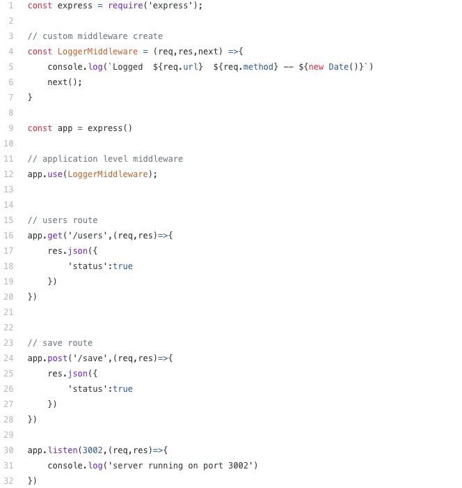
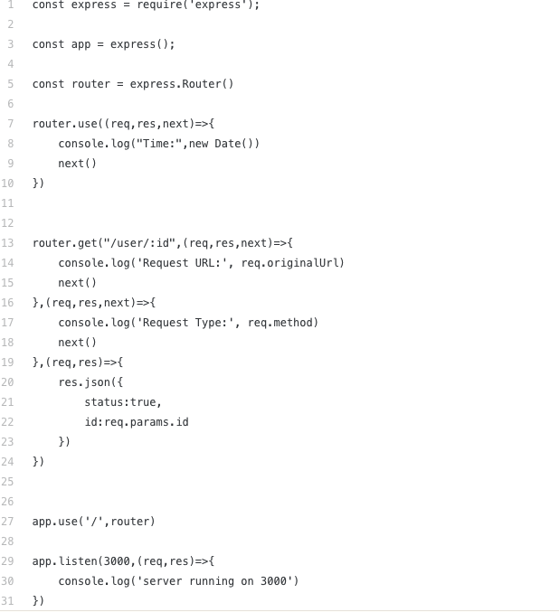

# Name 3 real world use cases where you’d want to change the request with custom middleware 

1. Auth middleware 
**Suppose we are having five routes getUsers,getDetails,updateDetails,isLoggedIn,isLoggedOut**

**every route must be authenticated if the user is not authenticated then he is not able to call the above mentioned routes,so every GET,POST calls required authentication.In this case we build a authtication middleware.**

**Now once the request comes the auth middleware will do some authentication logic that we have written inside it.Once authentication successful then remaining routed must be called using next()**

**if auth fails then it wont perform next route exit the middleware with error response logic**

2. Logging Middleware

3. Router Level Middleware
**Router-level middleware works in the same way as application-level middleware, except it is bound to an instance of express.Router().**

*const router = express.Router()*
*Load router-level middleware by using the router.use() and router.METHOD() functions.*

## True or false: The route handler is middleware ??
*False*

## In what ways can a middleware function end the process and send data to the browser?
**If the current middleware function does not end the request-response cycle, it must call next() to pass control to the next middleware function. Otherwise, the request will be left hanging.**

## At what point in the request lifecycle can you “inject” middleware?

**Nest middleware fully supports Dependency Injection. Just as with providers and controllers, they are able to inject dependencies that are available within the same module. As usual, this is done through the constructor**

## What can cause express to error with “Request headers sent twice, cannot start a second response”
* Maybe it realated on estimated time. 

| Term       |       Definition             |
| -----------|------------------------------|
|Middleware     |Middleware is software that enables one or more kinds of communication or connectivity between two or more applications or application components in a distributed network. ... There are many types of middleware. Some, such as message brokers or transaction processing monitors, focus on one type of communication. |
| Request Object| is the main entry point for an application to issue a request to the Library - all operations on a URL must use a Request object. The request object is application independent in that both servers and clients use the same Request class.|
| Response Object   | Represents a response from a web request initiated by fetch(). fetch(), Request and Response are a new, low level replacement for XMLHttpRequest.|
|Application Middleware   |  Middleware in the context of distributed applications is software that provides services beyond those provided by the operating system to enable the various components of a distributed system to communicate and manage data. Middleware supports and simplifies complex distributed applications.|
|Routing Middleware   | In Express, usually, we make end-points that uses HTTP verbs to denote a GET POST DELETE PUT etc requests. Router is used to manage these incoming requests. It kind of routes your requests to correct handler/code|
|Test Driven Development  | Is a software development process relying on software requirements being converted to test cases before software is fully developed, and tracking all software development by repeatedly testing the software against all test cases. This is as opposed to software being developed first and test cases created later. |
|Behavioral Testing |  Behavioural Testing is a testing of the external behaviour of the program, also known as black box testing. It is usually a functional testing.|

**Resources**
- Selvaganesh
- nestjs.
- wikipedia
